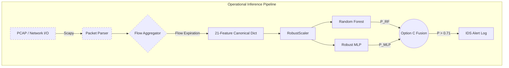

# Deliverable B: Technical Architecture Report

## 1. System Overview
The architecture is split into two distinct lifecycle phases: the **Offline Research & Training Pipeline** and the **Operational Inference Pipeline**.

## 2. Active Execution Paths
- **Training Path**: Raw Datasets -> Preprocessing (`RobustScaler`) -> Feature Masking -> Model Training (RF, Std MLP, DP-Rob-MLP) -> Checkpoint Export.
- **Inference Path (Offline)**: Canonical Feature Dictionaries -> Schema Validation -> `RobustScaler` -> Parallel Model Forward Passes -> Option C Probability Fusion -> Surrogate SHAP -> Alert Dict.
- **Inference Path (Live - Unverified)**: PCAP/Socket -> Scapy Parsing -> `FlowAggregator` -> EWMA state tracking -> Feature Vector -> Inference Path.

## 3. Data Flow and Module Responsibilities
- `iot_ids.data`: Responsible for loading parquet datasets, canonicalizing features, and performing chronological splits. Also houses the unverified `packet_capture.py` and `flow_aggregator.py`.
- `iot_ids.models`: Defines `RandomForestModel` and PyTorch `RobustMLP`.
- `iot_ids.inference`: `engine.py` merges the models and applies `0.7 * P_RF + 0.3 * P_MLP`.
- `iot_ids.xai`: Houses `local_xai.py` and exact SHAP audits.
- `scripts/`: Operational entry points (e.g., `04_benchmark_models.py`, `05_blackbox_attack_batched.py`, `benchmark_runtime_xai_privacy.py`).

## 4. Architecture Diagrams (Mermaid)

